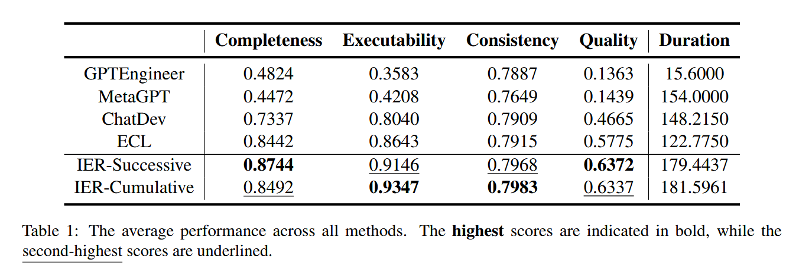

### Iterative Experience Refinement of Software-Developing Agents

**总结**

作者迭代式地改善软件开发agents，作者在前一个论文中的提出原学习的方法，也就是记录软件开发中的捷径，但在捷径检索中只是用了简单的语义检索。

本文，作者提出保持这些经验的方法：

- 连续更改，每个任务batch中，对前一个batch的经验进行优化
- 总结更改，根据前面所有batch的经验，更新出新的经验

最后作者又提出了一个经验elimination，也就是每次保留用得最多的经验，防止检索到无效的内容作为上下文，接着就是实验。

---

