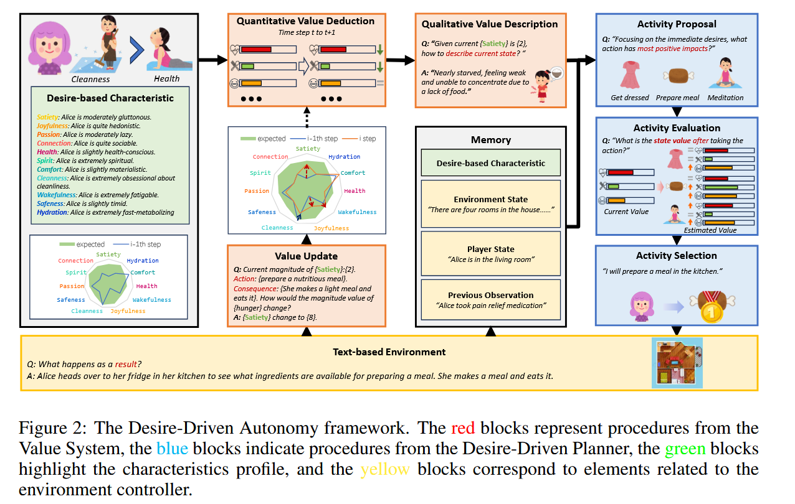

### SIMULATING HUMAN-LIKE DAILY ACTIVITIES WITH  DESIRE-DRIVEN AUTONOMY

**总结**

现在有许多使用大语言模型模拟人类行为的相关论文，使用强化学习训练等方法，但这些方法的大多数只限定为特定场景，无法拓展到人类日常生活中多样变化的场景中。

作者引入了欲望驱使的大预言模型agent，来预测模拟人们日常一天生活中的行为，分为了两个模块：环境模拟、欲望驱使agent。

环境模拟主要使用了Concordia论文的方法，做了一个日常生活的模拟器。

欲望驱使agent更为复杂，其中最重要的部分便是欲望上下文的生成：DESIRE GENERATION，VALUE SYSTEM FOR DESIRE EVALUATION。

DESIRE GENERATION：通过预设好的相关标准，将不同形容词的不同程度映射为一个值。

VALUE SYSTEM FOR DESIRE EVALUATION分为三部分：

- Quantitative Value Deduction：做选择题，推理出形容词不同值
- Qualitative Value Description：根据value做出总体描述
- Value Update：更新值

实验没咋看，准备还是看些对模型参数层面修改的论文，如LLM微调、强化学习等的论文。

---

