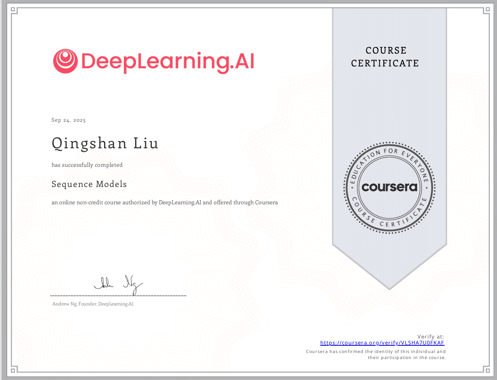

Coursera上的深度学习课程算是完成了个大概，序列模型里还是学到很多实用的知识，如RNN、GRU、LSTM、Embedding、Attention机制、transformer模型。

卷积模型的最后一章人脸识别暂时没看，主要当时还是想着快点加速自己了解NLP的基础知识的进度，视觉相关的可以后面补充，因为之后论文阅读大概率只和NLP相关。

课程内容都浅显易懂，并且配有作业。在上面的学习，主要深刻意识到了DL是一个很厉害的工具，我们可以用他做很多有意义的事情，并服务人类。而且并没有什么应用难度，人人都可以学习DL这个工具，应用到自己生活中（虽然黑盒，也就因为黑盒，才能超越人类认知）...

后面主要继续深入LLM的学习中，多看一些LLM经典论文，先打好基础，再投入到前沿研究中。

