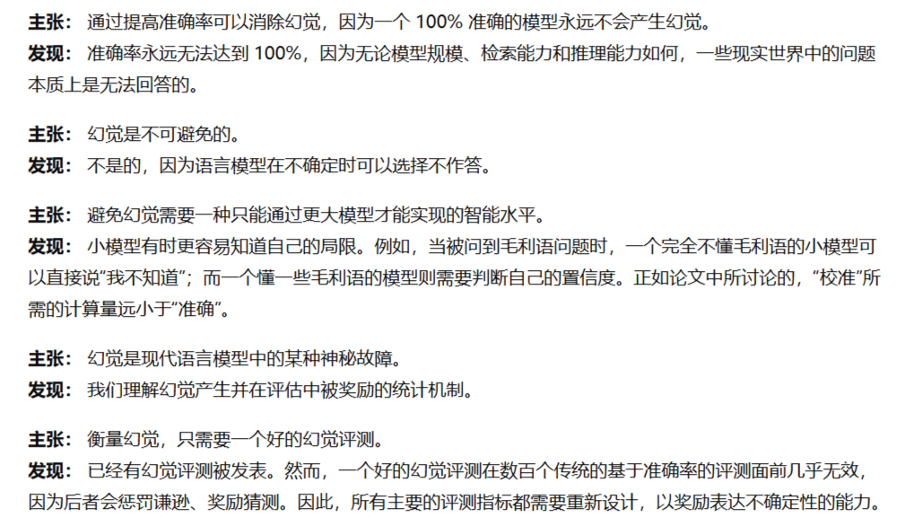

### EduAgent: Generative Student Agents in Learning

**总结**

本文是针对线上教育领域的学生模仿相关的研究，之前的模型多利用庞大的数据对学生学习行为进行预测，随着LLM的问世，LLM提供的前置知识能很好的针对不同场景不同内容线上教育的学生行为预测。

学生行为预测受到多方面的影响，如性格、学生储备知识等，本文提供了一个数据集（350个sample），针对一段5分钟的幻灯片讲解，提供学生个人信息和每个小时间段的学生注意窗口、行为、认知状态信息等。

作者结合LLM强大的推理功能，让LLM自主推理出不同信息间的关联，从而实现学生行为的预测和模仿，但这篇论文的实验没咋看懂...

---

### LLM-mediated domain-specific voice agents: the case of TextileBot

**总结**

粗粒度地看了下...

只看了摘要和引言和结论，讲的是如何原型化地设计一个垂直领域的对话agent，包含prompt模板，随后作者自己设计了一个宣传服装环保领域的一个agent（在购物的时候跟顾客交流的），并做了用户实验。

---

### Why language models hallucinate

**总结**

[Why language models hallucinate | OpenAI](https://openai.com/index/why-language-models-hallucinate/)

OpenAI 9月5号刚发布的文章，主要讲述了为什么大语言模型会产生幻觉。

作者描述，LLM（大语言模型）之所以产生幻觉，是因为现在对模型后训练的奖励函数，往往将答错一道题和拒答一道题（承认不知道）的惩罚都是一致的，导致LLM更倾向于去猜题，这样还有概率猜对。

那有人就会说了，让答错的惩罚提升一些不就行了。确实可以，但是作者回应到现如今大多数的benchmark，只有对/错两个选项，并没有考虑到幻觉的因素，从而导致大家更宁愿LLM猜题，增加一些benchmark的准确率，而不是拒答（大幅度降低幻觉，但准确率会略微降低）。

作者呼吁所有benchmark的制作者们，将幻觉这个评价指标加入到benchmark的评测之中，从而抑制LLM的胡言乱语。但现在的benchmark对幻觉的评判往往是特定的一类，大多数benmark没有考虑幻觉因素。

上面都是通过后训练降低LLM幻觉的途径，那能不能在预训练的时候降低大语言模型的幻觉呢？作者回答，现在的数据都是无监督的，导致LLM并没有办法对每段数据的真实性做判断，更好的办法还是在后训练的时候减少大模型的幻觉。

下图是原文的提出的LLM幻觉的一些误解与澄清：

