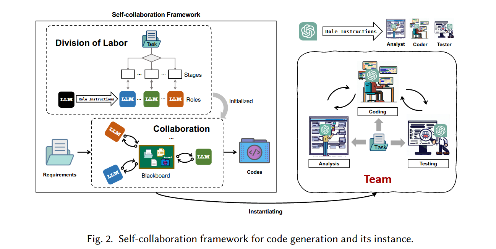
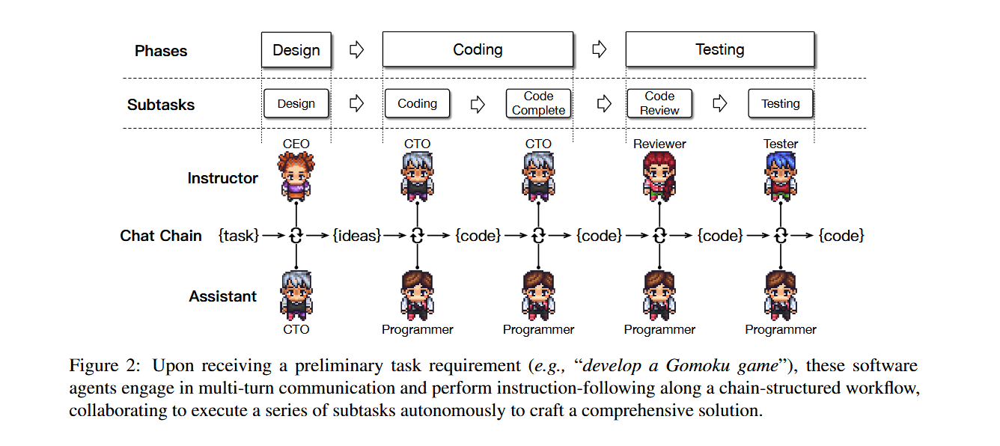

### Self-collaboration Code Generation via ChatGPT

**总结**

2023年的一篇上古论文了（GPT-3.5时代），讲的是如何通过多智能体协作结合软件工程的一些方法论实现代码生成。
框架中不同智能体是通过prompt驱动的。

首先将问题分解为不同stage，如何不同stage通过三个智能体：分析师、代码师、测试师 来解决完成的，如下图所示。

然后作者针对框架提出6个不同的RQ(论文标题写错了RQ6写成RQ7了hhh)，并实验分析。

- RQ1: Self-collaboration vs. Baselines

- RQ2: The Effect of Roles in Self-collaboration

- RQ3: Self-collaboration on Different LLMs

- RQ4: The Effect of Interaction

- RQ5: Analysis for Self-collaboration

- RQ6: How does self-collaboration work in repository-level software development scenarios and how does it perform?

---

### ChatDev: Communicative Agents for Software Development

**总结**

好久以前的经典文章了，感觉是上面文章的加强版，也是关于LLM agent实现软件开发的。

本文在软件瀑布开发过程的每个phase中引入了讨论的机制，但只有两个agent讨论，一般是instructor和assistant。通过语言交流的过程，将交流过程的批判和分析，作为推理从而生成下一轮的代码，如下图。

本文有一个减轻幻觉的机制，就是让assistant与instructor交流过程中主动进入询问环节，提出自己需要的更明确的信息给instrutor，从而缓解instructor提出模糊的需求，从而导致assistant生成内容的幻觉，通过多轮迭代优化代码完整性和准确性。

