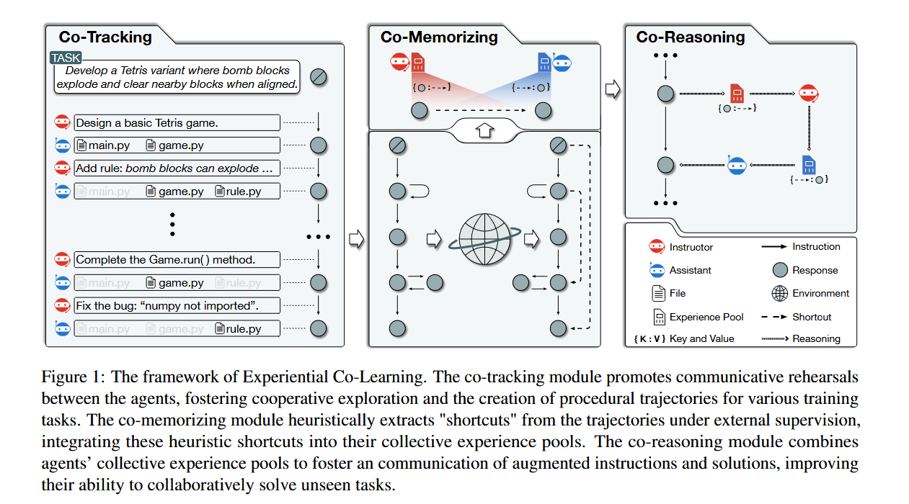

### Experiential Co-Learning of Software-Developing Agents

**总结**

非常有意思的一篇文章，是前一篇agent进行软件工程的ChetDev的续集。前一篇主要加入instructor和assistant的交流互动，提高软件生成的可行性，这篇注重设计如何提高agent利用历史经验的能力。作者提出，多轮的交流互动记忆系统不一定可能会降低llm生成内容的质量，我们需要提取出能提升的边，并且学习如何在软件开发中走“最短路”。

论文学习能力的设计分为三个部分：co-tracking module、co-memorizing module、co-reasoning module

- co-tracking：作者将历史交流记录抽象为assistant的solution为点，instructor的instruction为边的一条链
- co-memorizing：探索这条链是否能创造捷径，减少中间交流过程，然后记录下跨越经验。比如Si点可以跨越到Sj点（i<j），那么llm根据两个点生成边（instruction），并且记录下这些边，供后面别的任务提供经验。
- co-reasoning：top-k检索相应的捷径边，为instructor和assistant提供捷径。

最后是论文的实验部分，分为Completeness Executability Consistency Quality Duration、胜率测评；定性分析；效率分析；可行性分析；参数敏感性分析（这部分没咋看hhh，但前半部分的原学习框架的设计还是很novel的）

