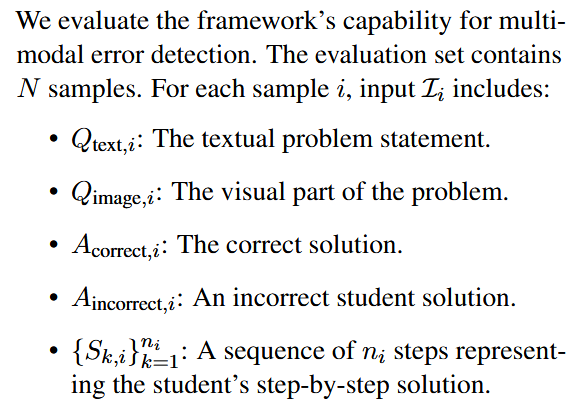
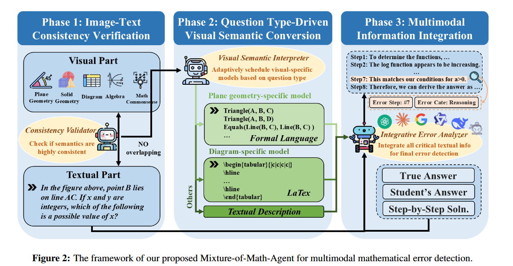
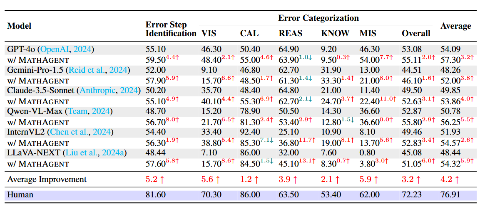

### LLM Agents for Education: Advances and Applications

**总结**

这是一篇综述论文，讲述了现在LLM agents在领域的各种运用。作者将教育agent分为 教学agent 和 垂直领域agent。 

教学agent又分为面向学生和面向教师的，垂直领域的分为很多不同学科类的agent，不同学科agent也有不同的功能的agent，整体分类思维导图见下图。

然后作者讲述了，现有教育agent所面临的困难，如道德、偏见方面的，也有幻觉、可靠性方面的。现有的agent大多数不具备结构化的形式（更多是对话类型），无法直接在现实教育场景中插入。

最后整理介绍了现有测评教育agent各种benchmark，以供后来研究者使用。

---

### MATHAGENT: Leveraging a Mixture-of-Math-Agent Framework for Real-World Multimodal Mathematical Error Detection

**背景**

大语言模型在数学问题求解中已经非常厉害了，但是在数学错误发现上还很少涉足。传统的数学老师批改，耗时耗力，并且不具备可扩展性，如无法为学生指明学生具体错误（人工成本高），多模态大模型可以识别图片，并且为学生提供错误位置和错误分类，但是MLLM还在存在较多错误，对于有细微错误的地方无法很好识别。并且现在研究多聚焦纯文本数学题改错，对于带有图片信息的不能很好应对。

**方法**

数据集合为下图，有文本问题描述，图片类信息，正确答案，学生的不正确答案，解题步骤。
任务分为  1：找到第一个错误步骤，2：错误分类，指标都是准确率。	

作者引入了个多智能体框架，分为三个部分，流程如下图。

- 文本-图像一致性检测：判断图片和文字是否高度一致，避免使用图片识别功能，从而增强题目解读能力
- 公式-表格识别：用专门model将各种公式、表格等识别为文本形式
- 融合找错：将文本和转文本的图片信息融合为一个完整题目，并且让LLM完成上面具体两个任务

**实验结果**

将该方法运用到多个多模态大模型，大部分都能提升准确率，但相较于人工还有很大的差距。

论文写的浅显易懂，结构也很清晰，可惜本论文并未公布数据集。。。
