## 背景

初始Qwen3-0.6B在GSM8K的准确率不到20%，问题主要分为以下两种情况：

- 未能按照prompt的答案格式 输出 答案
- 未能计算出正确答案

经测试主要发现准确率低的原因是主要是前者导致，少部分是后者。本质上就是小模型的指令跟随和推理能力的不足。

如今LLM已经有大量不同的微调方式，如强化学习微调、SFT等方向，本实验为**探索GRPO在LLM微调的效果上限与优势。**


## 目标

- 通过 **GRPO** 微调 Qwen3-0.6B，寻找在 **验证集**上的最优超参数组合。  
- 使用 **Qwen32B 生成答案进行蒸馏** + LoRA 微调 Qwen3-0.6B，并与 GRPO 方案对比。


## 方法概览

- **框架**：Verl  
- **基座模型**：Qwen3-0.6B  
- **优化**：GRPO
- **对比**：Qwen32B 蒸馏 → LoRA on Qwen3-0.6B


## 调节的超参数

| 超参数                          | 重要度 | 推荐范围 / 设定                                    | 当前值            | 影响 / 说明                                       |
| ------------------------------- | ------ | -------------------------------------------------- | ----------------- | ------------------------------------------------- |
| 学习率 (LoRA, `actor.optim.lr`) | ⭐⭐⭐⭐⭐  | 1e-5 ～ 5e-5                                       | **5e-5**          | 直接影响收敛与最终性能，建议从小到大网格/二分搜。 |
| 响应数量 (`rollout.n`)          | ⭐⭐⭐⭐   | 5 ～ 16                                            | **5 / 16**        | 更多样本可提升 GRPO 信号质量，但显著增算力。      |
| KL 系数 (`kl_loss_coef`)        | ⭐⭐⭐⭐   | 1e-4 ～ 1e-2                                       | **1e-3**          | 约束与参考模型偏离度；过大抑制探索、过小易漂移。  |
| 批次大小                        | ⭐⭐⭐⭐   | train 64/128/256/512；mini 32/64/128；micro 4/8/16 | **128 / 64 / 16** | 更大批次更稳（受显存限制）。                      |
| 采样温度 (`temperature`)        | ⭐⭐     | 0.7 / 1.0 / 1.2                                    | **1.0**           | 多样性与探索；高温度利探索但易噪声。              |
| Top-p (`top_p`)                 | ⭐⭐     | 0.7 / 0.9 / 1.0                                    | **1.0**           | 控制尾部截断；与温度配合调度探索强度。            |


## 实验计划

1. 调整verl框架的GRPO的超参数，微调Qwen3-0.6B，探索最大验证集表现的超参数。
2. 使用Qwen32B模型，蒸馏答案，Lora微调Qwen3-0.6B，并与上面方式对比。


## 实验过程

#### 初始实验

首先在使用LLM生产了一组初始参数，并跑通。

```bash
#!/bin/bash  
set -x  
  
cd /mnt/data/home/liuqingshan/wanghai673/RL-test/verl  
ls
MODEL_PATH=/mnt/data/home/liuqingshan/wanghai673/RL-test/models/Qwen3-0.6B
  
python3 -m verl.trainer.main_ppo \
  algorithm.adv_estimator=grpo \
  algorithm.kl_ctrl.kl_coef=0.001 \
  data.train_files="${HOME}/data/gsm8k/train.parquet" \
  data.val_files="${HOME}/data/gsm8k/test.parquet" \
  data.train_batch_size=128 \
  data.max_prompt_length=512 \
  data.max_response_length=512 \
  data.filter_overlong_prompts=True \
  data.truncation=error \
  data.shuffle=False \
  actor_rollout_ref.model.path="${MODEL_PATH}" \
  actor_rollout_ref.model.enable_gradient_checkpointing=True \
  actor_rollout_ref.model.use_remove_padding=False \
  actor_rollout_ref.model.lora_rank=32 \
  actor_rollout_ref.model.lora_alpha=32 \
  actor_rollout_ref.model.target_modules=all-linear \
  actor_rollout_ref.actor.optim.lr=5e-7 \
  actor_rollout_ref.actor.ppo_mini_batch_size=64 \
  actor_rollout_ref.actor.ppo_micro_batch_size_per_gpu=8 \
  actor_rollout_ref.actor.use_kl_loss=True \
  actor_rollout_ref.actor.kl_loss_coef=0.001 \
  actor_rollout_ref.actor.kl_loss_type=low_var_kl \
  actor_rollout_ref.actor.grad_clip=1.0 \
  actor_rollout_ref.actor.entropy_coeff=0.0 \
  actor_rollout_ref.actor.fsdp_config.param_offload=True \
  actor_rollout_ref.actor.fsdp_config.optimizer_offload=True \
  actor_rollout_ref.rollout.name=vllm \
  actor_rollout_ref.rollout.tensor_model_parallel_size=2 \
  actor_rollout_ref.rollout.gpu_memory_utilization=0.6 \
  actor_rollout_ref.rollout.n=5 \
  actor_rollout_ref.rollout.temperature=1.0 \
  actor_rollout_ref.rollout.top_p=1.0 \
  actor_rollout_ref.rollout.top_k=-1 \
  actor_rollout_ref.rollout.enable_chunked_prefill=True \
  actor_rollout_ref.rollout.load_format=safetensors \
  actor_rollout_ref.ref.fsdp_config.param_offload=True \
  trainer.critic_warmup=0 \
  trainer.logger='["console","wandb"]' \
  trainer.project_name=qwen3_grpo_gsm8k \
  trainer.experiment_name=exp_1 \
  trainer.n_gpus_per_node=2 \
  trainer.nnodes=1 \
  trainer.total_epochs=10 \
  trainer.total_training_steps=500 \
  trainer.save_freq=50 \
  trainer.test_freq=10 \
  trainer.default_local_dir=./checkpoints/${trainer.project_name}/${trainer.experiment_name}\
  actor_rollout_ref.rollout.log_prob_micro_batch_size_per_gpu=8 \
  actor_rollout_ref.ref.log_prob_micro_batch_size_per_gpu=8 \
  2>&1 | tee training.log

```

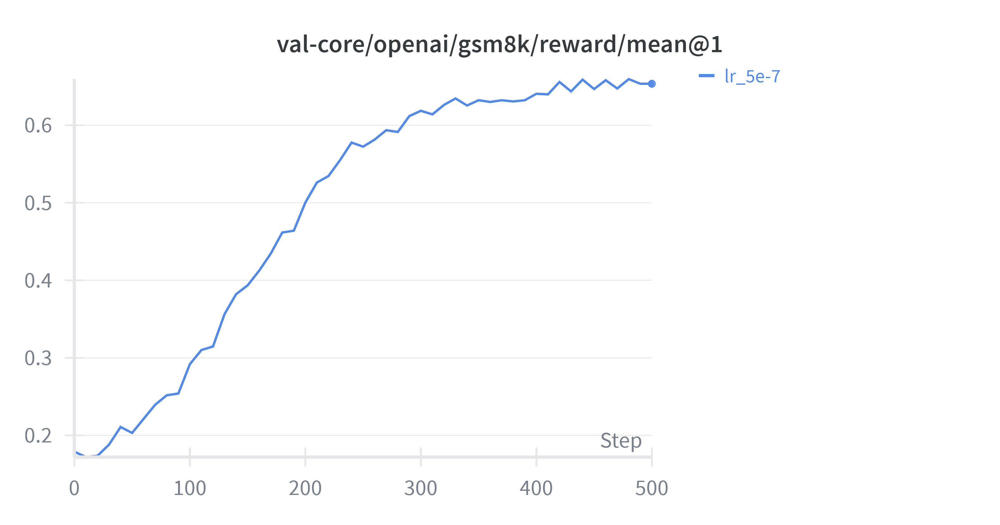

total_training_steps总共训练到了500steps，时间长达10h，为了方便后续实验快速进行，我做出了如下修改：

- total_training_steps = 100
- gpu_memory_utilization = 0.8
- test_freq= 5
- ppo_micro_batch_size_per_gpu = 16

这样修改后每个实验大概能在3h左右做完，大大加快了对比的速度。

---

#### 对比不同LR下的实验结果

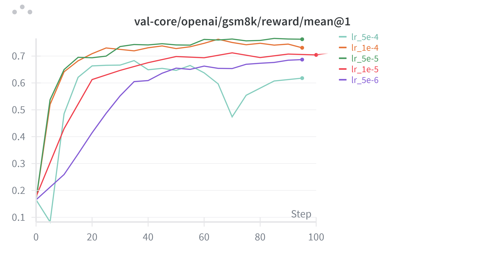

上面是不同lr在验证集上的表现，观察发现5e6 ~ 5e5之间训练比较稳定，并且效果稳定上升，但大于5e5的学习率出现了明显的抖动，
随后挑选5e5为之后实验的学习率。

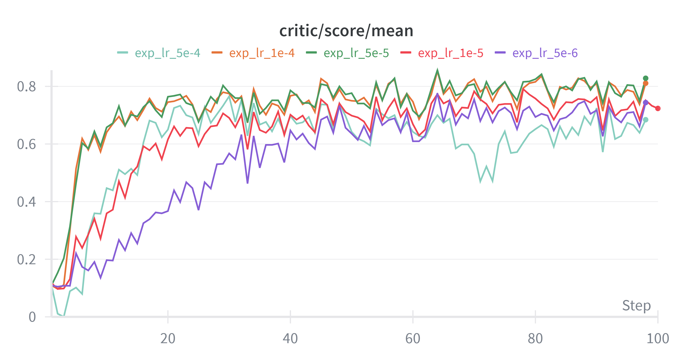

训练集上奖励模型打分与验证集合上呈现一致的趋势，并且不存在太大的过拟合问题，考虑到主要原因是因为epoch跑了不到2个，其实训练集的得分和验证集合基本都是在做新题目。

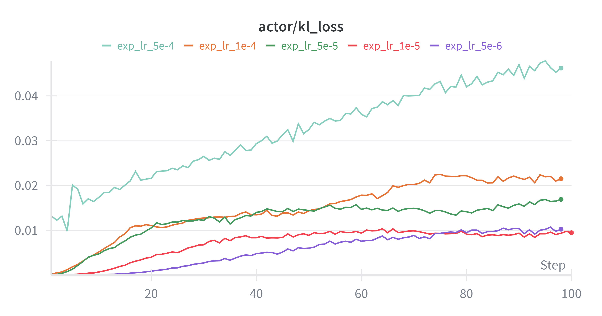

学习率越高模型就越偏离最初模型。

---

#### 对比不同rollout-n下的实验结果

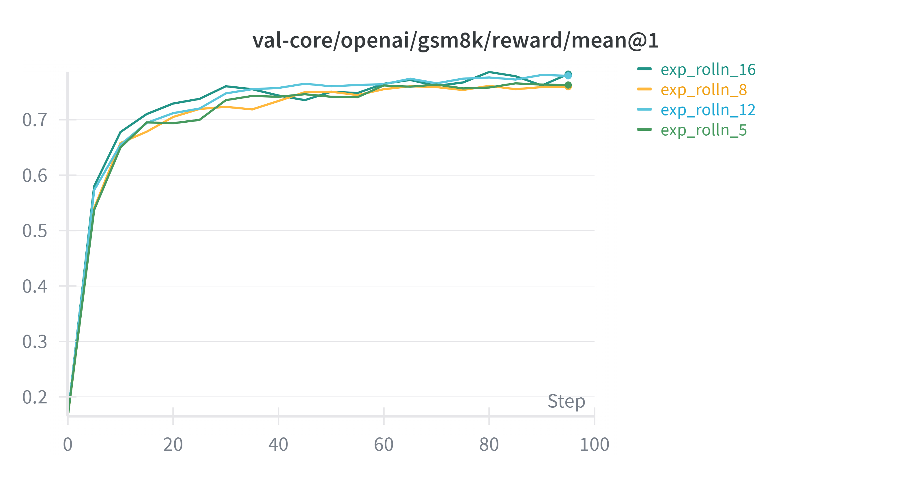

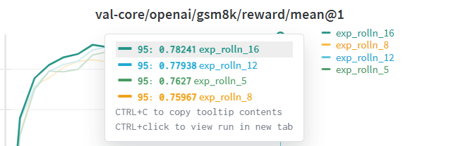

实验发现rollout数量增加，能略微提高效果，5->8->12训练更加稳定。

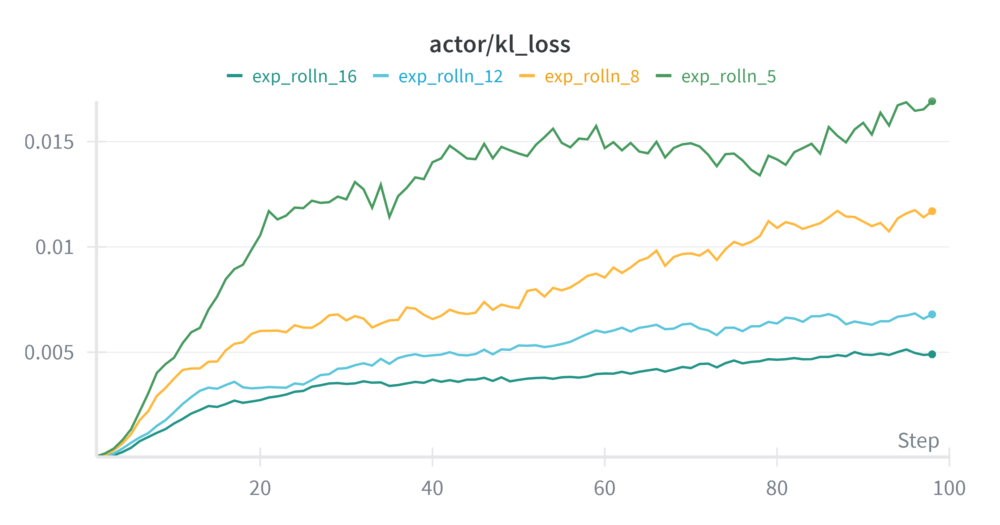

rolloutn越大模型偏离参考模型的程度越小，但效果不会更差，说明随着rolloutn上升训练更加稳定，方差更小。


---

#### 对比不同kl系数下的实验结果

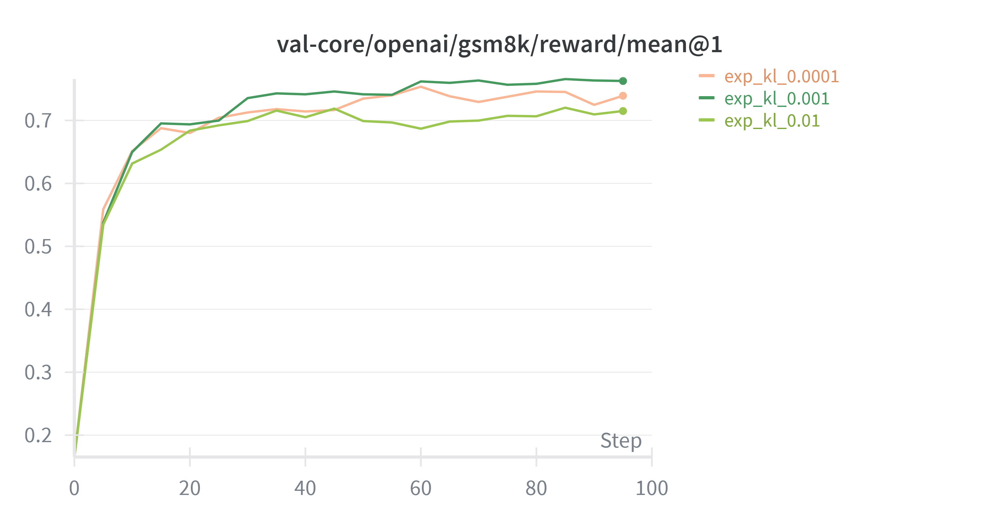

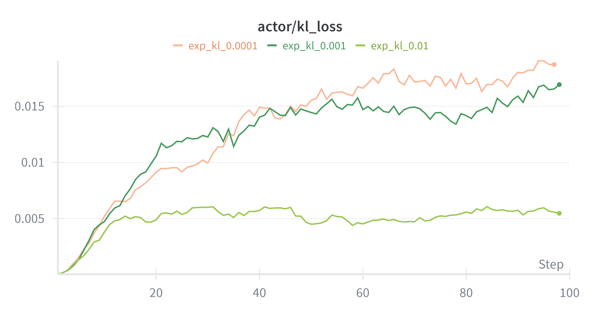

kl系数越到kl_loss显然越小，但根据上面设置kl过大会限制模型更新，过小会使得模型偏离参考模型太大，kl取0.001较为适中。


---

#### 对比不同batchsize下的实验结果

| 序号 | train_batch_size | ppo_mini_batch_size | ppo_micro_batch_size_per_gpu |
| ---- | ---------------- | ------------------- | ---------------------------- |
| 1    | 128              | 32                  | 4                            |
| 2    | 256              | 64                  | 8                            |
| 3    | 512              | 128                 | 16                           |

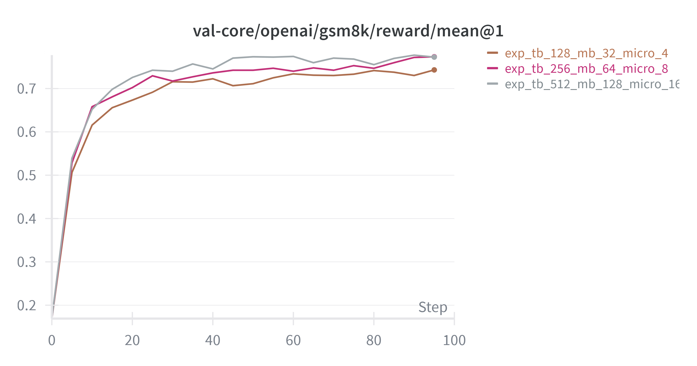

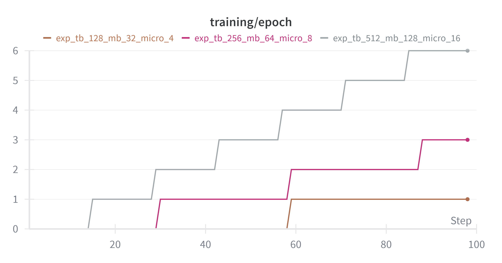

在micro_batch不是太小的情况下，训练效果差不多。micro_batch足够大，总steps的一样的情况下，模型效果主要受梯度累积步数，梯度累积步数越小，那么模型更新的次数越多，训练速度和效果也会相应变好。
