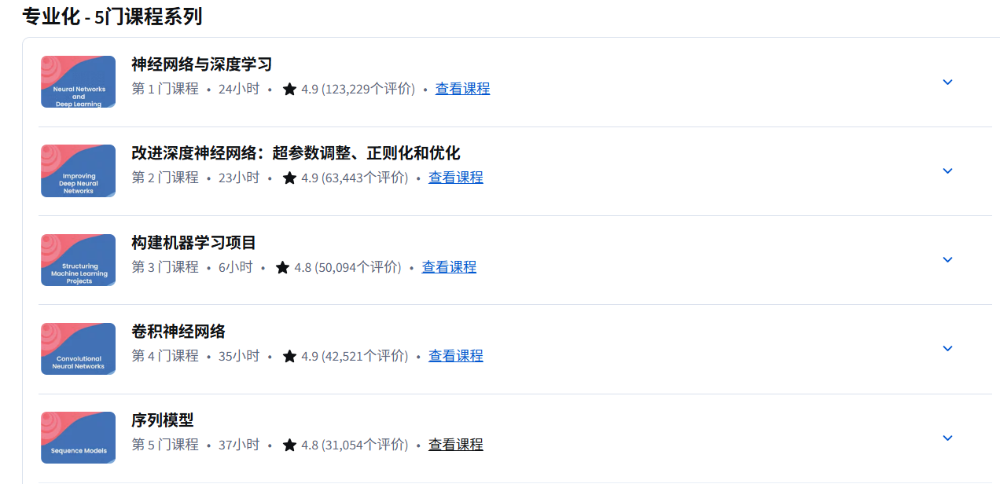

最近在重新回顾深度学习相关基础，之前大概过了一遍李沐的动手学深度学习，但很多内容还一知半解，
感觉网上课程难度曲线还是不太平滑。

无意间看到 [Coursera平台](https://www.coursera.org/)，在淘宝上花了80买了个半年号，仿佛打开新世界了，第一次看到了原来真的有课程能把深度学习的学习曲线
弄的这么平滑的，爱了，有点像算法竞赛的acwing、牛客。感觉b站确实不错，但是反馈和互动肯定远远比不上Coursera的。

现在刚学完第一门课程，并手动设计并实现了多层卷积神经网络（只用到numpy），在这里记录一下forward/back propagation的数学知识（主要是线性代数）。

#### 正向传播

.jpg)

非常简单易懂，就是矩阵乘法。

#### 反向传播

##### 引理一

.jpg)

.jpg)

搞懂这个引理反向传播就差不多弄懂了，求哪个偏导，固定某行/列值算贡献 就好求了（A固定行，B固定列），因为矩阵乘法是B的列与A的行做点积。

.jpg)

以上就是神经网络里的线性代数的一些知识，其实不需要太多基础弄得矩阵乘法，和求导链式法则即可手写神经网络。

