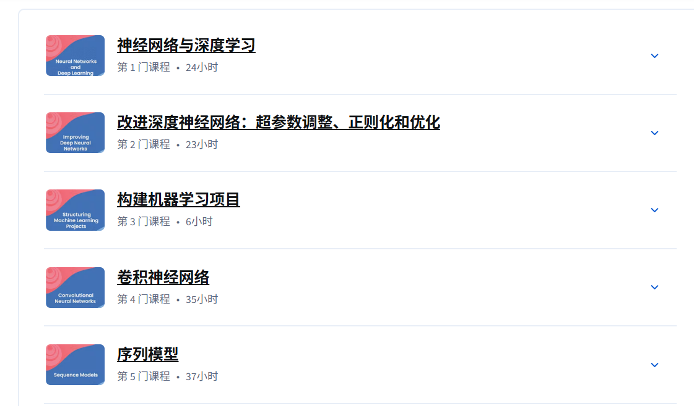
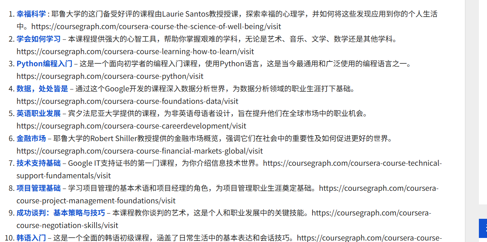

最近都在广泛学习一些有趣的内容，主要是通过coursera平台。在家呆了2个多月了，也不知道未来啥方向，目前也是有些迷茫的状态，还是学些东西充实下自己吧，搜寻一下感兴趣的东东。

coursera平台类似于国外的mooc，国内外还有好多这样的平台，如中国大学mooc、bilibili大学、网易云课等等。coursera需要付费会员才能观看课程，而且只能通过国外信用卡付款（无）。于是，我在淘宝一搜，这么多卖号，而且很便宜，86半年，立马充值了一波。

有了平台，我立马重新在coursera里，拾起深度学习的基础知识，吴恩达的课程。之前只听过，在coursera认真地观看，还是感觉受益匪浅，毕竟有作业有互动，感觉b站还是差点味道。

现在主要看了深度学习专项课程的前3个：

其实就相当于复习了一下之前在李沐动手学深度学习的内容。

然后光看深度学习也有些乏味，我在网上搜索coursera有没有其他好课程，打开了一个课程排名，类似于垃圾小网站的那种：

然后最近在看幸福科学，才刚开始看，讲的是如何变得幸福，通过科学的方式，感觉讲的还挺好的，在实验的加持下，科学成为人们可以坚持最大的迷信，hhh，但是还是要有反驳精神，感觉很多科学实验严谨性还是有些欠缺。

之后的日子，想了解一下金融相关的知识，挺感兴趣的。马上要开学了，5555，希望能保持学习一些课外内容的习惯。还有，运动也要保持，在家和爸妈打了一个暑假的乒乓球，每日锻炼~

