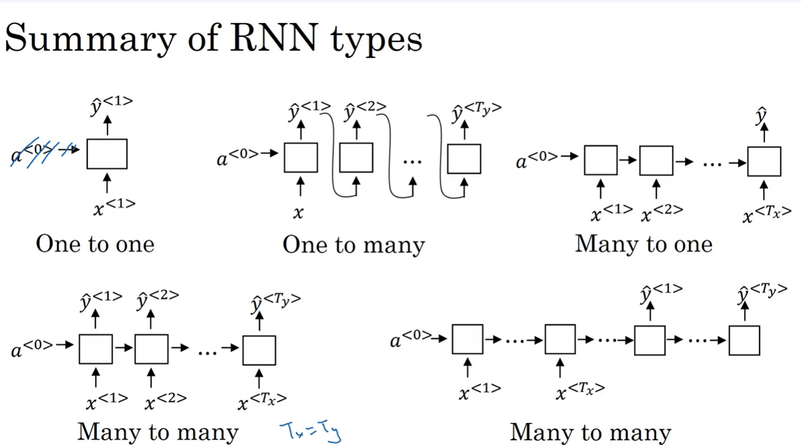
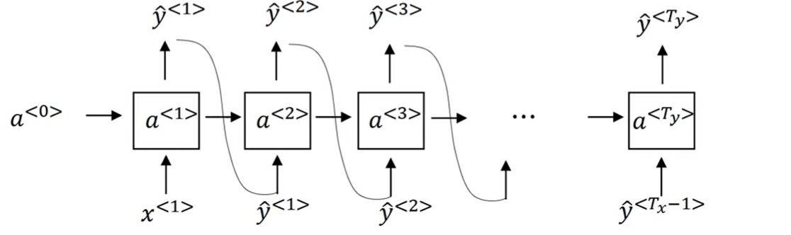
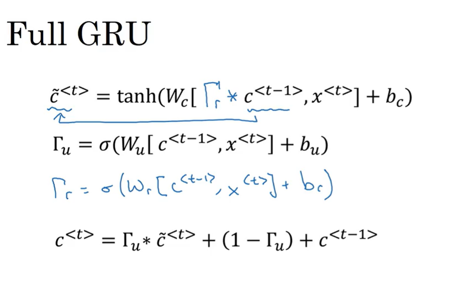
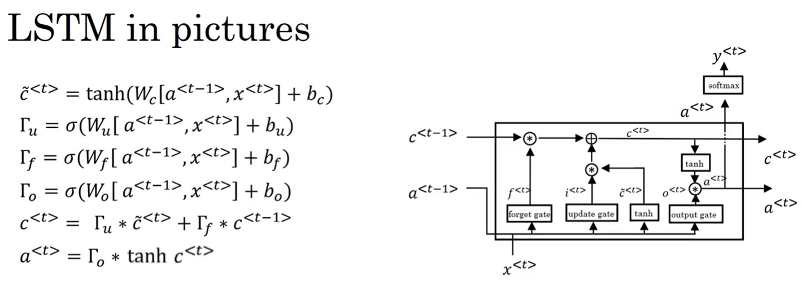
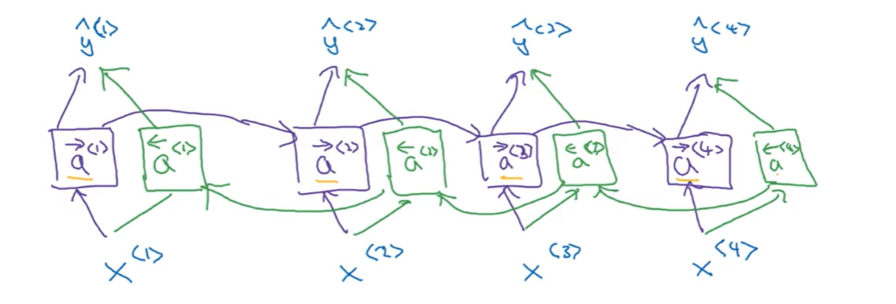
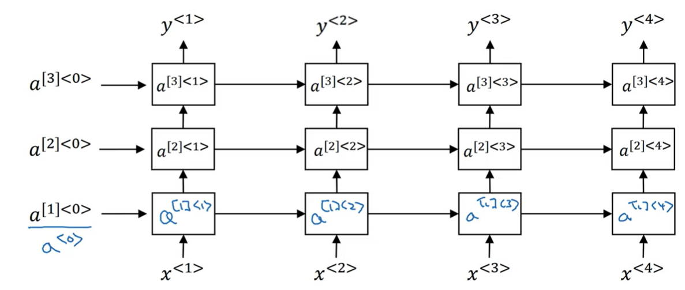

Coursera上的深度学习课程算是完成了个大概，序列模型里还是学到很多实用的知识，如RNN、GRU、LSTM、Embedding、Attention机制，下面是一些知识点学习记录。

#### RNN的不同应用

1. 语音识别
2. 音乐生成
3. 情感分类
4. DNA序列分析
5. 机器翻译
6. 视频活动识别
7. 命名实体识别

#### RNN的架构类型

#### RNN的生成语言模型 和 采样

学习beamsearch算法对模型生产序列进行采样，本质上也是种贪心算法。

#### 引入LSTM和GRU

传统RNN随着上下文一长，由于模型隐藏层变量大小限制，会丢失掉部分上下文信息。随后，引入了记忆门的装置，能够使得记忆信息直接传递给后续节点。

**GRU结构：**

**LSTM结构：**

对于特定问题，如完形填空等，需要不仅前文内容，还需要后文的内容随后，引入**双向RNN**。

一个全连接层可能，无法很好提取上下文信息，随后引入**深度RNN**

之后完成了JAZZ创造的**生成式RNN的作业**：https://www.coursera.org/learn/nlp-sequence-models/programming/ZS7X2/jazz-improvisation-with-lstm/lab

课程内容都浅显易懂，并且配有作业。在上面的学习，主要深刻意识到了DL是一个很厉害的工具，我们可以用他做很多有意义的事情，并服务人类。而且并没有什么应用难度，人人都可以学习DL这个工具，应用到自己生活中（虽然黑盒，也就因为黑盒，才能超越人类认知）...

