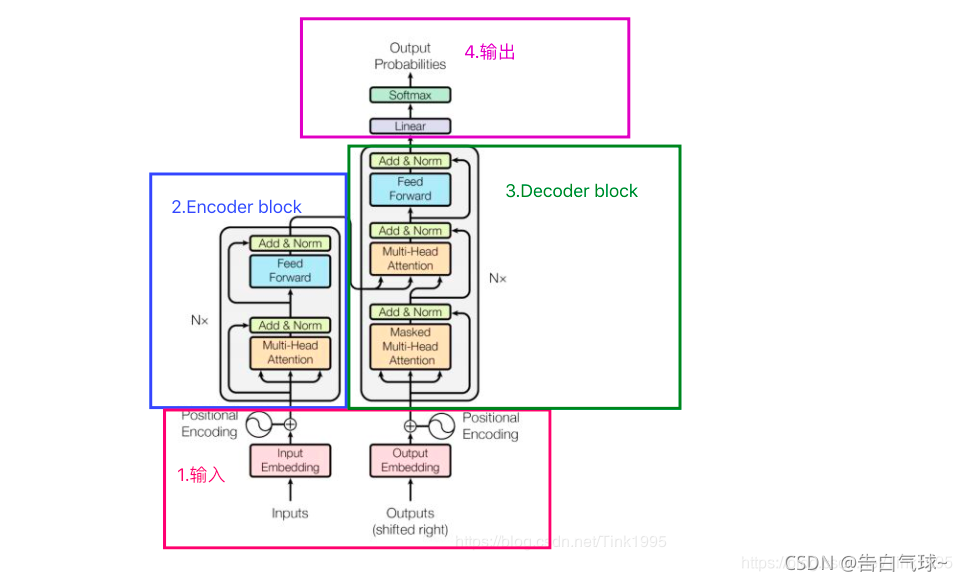

### Transformer 架构学习

学习了 self-attention、multi-head attention 机制，位置编码等，并手动搭建了 Transformer 架构。并利用 Transfomer 框架实现了一个[名字实体识别](https://www.coursera.org/learn/nlp-sequence-models/ungradedLab/RdNV9/transformer-network-application-named-entity-recognition/lab)、[问答生成](https://www.coursera.org/learn/nlp-sequence-models/ungradedLab/6iTj6/transformer-network-application-question-answering/lab?path=%2Fnotebooks%2FW4A3_UGL%2FQA_dataset.ipynb)的任务（模型参数没上去，表现不如 RNN）。

### LLM 历史了解

**1、GPT, GPT-2, GPT-3**

[GPT，GPT-2，GPT-3 论文精读【论文精读】\_哔哩哔哩\_bilibili](https://www.bilibili.com/video/BV1AF411b7xQ/?spm_id_from=333.1387.search.video_card.click&vd_source=cf35d5107dda9df709c41cc1ec25735f)

- GPT：Transformer 的 Decoder Only 的模型始祖
- GPT-2：加大参数量，并在 fewshot 领域实现进步，但较同时期 Bert 进步不明显
- GPT-3：继续加大参数和数据量，模型能力在微调和 fewshot 后大大提升

**2、Bert**

[BERT 论文逐段精读【论文精读】\_哔哩哔哩\_bilibili](https://www.bilibili.com/video/BV1PL411M7eQ/?spm_id_from=333.1387.search.video_card.click&vd_source=2205a224ef8d2cd2b3b9cb444289192a)

Encoder Only 的模型始祖

**3、Instruct GPT**

[InstructGPT 论文精读【论文精读·48】\_哔哩哔哩\_bilibili](https://www.bilibili.com/video/BV1hd4y187CR/?spm_id_from=333.337.search-card.all.click&vd_source=cf35d5107dda9df709c41cc1ec25735f)

RLHF 就是这里来的

**4、GPT-4**

[GPT-4 论文精读【论文精读·53】\_哔哩哔哩\_bilibili](https://www.bilibili.com/video/BV1vM4y1U7b5/?spm_id_from=333.1387.search.video_card.click&vd_source=cf35d5107dda9df709c41cc1ec25735f)

模型能力涌现

**5、Llama 3.1**

经典的开源大模型

[Llama 3.1 论文精读 · 1. 导言【论文精读·54】\_哔哩哔哩\_bilibili](https://www.bilibili.com/video/BV1WM4m1y7Uh/?spm_id_from=333.788.videopod.sections&vd_source=cf35d5107dda9df709c41cc1ec25735f)

### 大模型 SFT

雷智凯同学总结的文档来学习大模型的 SFT 微调，一步步的教学 transformer 库的核心函数是怎么用的，如 tokenizer，AutoModelForCausalLM 等；手动搭建 Dataset。

#### **练习**：对病句改错数据集进行 SFT 微调

### 📘 Few-shot 示例

| 用户输入 (user)                                                                  | 模型输出 (assistant)                                                           |
| -------------------------------------------------------------------------------- | ------------------------------------------------------------------------------ |
| 全国光伏发电平均利用率达 98%，利用水平明显提高。                                 | 全国光伏发电平均利用率达 98%，利用水平明显提高。                               |
| #晚安.spuer#希望我们都能在山川尔尔里找到让自己感到快乐还有意义的事，并坚持下去。 | #晚安.spuer#希望我们都能在山川尔里找到让自己感到快乐还有意义的事，并坚持下去。 |
| 按照定逾期未检验车辆不得上路行驶。                                               | 按照规定逾期未检验车辆不得上路行驶。                                           |
| ✨ 你终回像星星那般发光发亮早安#早安#                                            | ✨ 你总会像星星那般发光发亮早安#早安#                                          |

---

### 🔬 LLM Finetune 实验结果表

| ID    | System Prompt | Finetune | Few-shot | Avg. Acc (%) | Pos. Acc (%) | Neg. Acc (%) |
| ----- | ------------- | -------- | -------- | ------------ | ------------ | ------------ |
| **6** | ✅            | ✅       | ✅       | **56.02**    | **82.4**     | **30.35**    |
| **4** | ✅            | ✅       | ❌       | 53.55        | 71.4         | 36.19        |
| **5** | ✅            | ❌       | ✅       | 9.76         | 16.4         | 3.31         |
| **2** | ✅            | ❌       | ❌       | 7.30         | 12.20        | 2.53         |
| **3** | ❌            | ✅       | ❌       | 3.55         | 5.2          | 1.95         |
| **1** | ❌            | ❌       | ❌       | 0            | 0            | 0            |

---

### 💡 总结观察

- **System Prompt + Finetune + Few-shot (ID 6)** 组合效果最佳，平均准确率最高（56.02%），正样本识别表现尤其突出（82.4%）。
- 仅使用 **System Prompt + Finetune (ID 4)** 也表现良好，但略低于全组合。
- 缺少 Finetune 或 Few-shot 时（如 ID 5、2），性能急剧下降。
- **无任何增强 (ID 1)** 表现最差，验证了各增强手段的重要性。

#### ID 6 微调 checkpoint 下变化

.png)

这张图展示了 **短训练周期** 下模型在不同 checkpoint 的正样本与负样本准确率变化趋势：

- **橙线（Positive Accuracy）**：随训练进行迅速上升，从约 17% 提升到接近 **96%**，并在后期保持稳定。
- **蓝线（Negative Accuracy）**：增长缓慢，整体维持在 **5%–10%** 区间，说明模型早期主要学习了正样本特征，而对负样本区分能力仍较弱。

---

.png)

这张图展示了 **长训练周期** 下模型在不同 checkpoint 的正样本与负样本准确率变化趋势：

- **正样本准确率（橙线）**：从约 85% 提升至 **94.8%**，随后保持在高位，说明模型对正确样本的识别能力持续增强。
- **负样本准确率（蓝线）**：从约 14% 稳步提升至 **30% 左右**，增长缓慢但持续，表明模型逐渐学会区分错误样本。

---

.png)

这张图展示了 **不同 checkpoint 下模型的平均准确率变化趋势**：

- **长训练周期（橙线）**：模型准确率从约 49% 稳步提升至接近 **59%**，在 120–210 checkpoint 区间达到高点并趋于稳定，说明模型已收敛。
- **短训练周期（蓝线）**：准确率快速上升，在第 9–10 个 checkpoint 达到约 **50%** 后趋于平稳，说明早期学习效率高，但提升空间有限。
